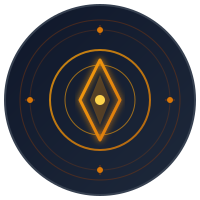

<p align="center">
  
</p>

<h1 align="center">🔭 CHRONOSCOPE</h1>

<p align="center">
  <strong>Programme ORPHÉE</strong><br/>
  <em>Open Research Project for Historical Echo Exploration</em>
</p>

<p align="center">
  <strong><em>Machines have learned to invent the past. We are learning to read it.</em></strong>
</p>

<p align="center">
  <a href="LICENSE">
    
  </a>
  <a href="https://github.com/fabiopiazza59-hue/chronoscope/stargazers">
    
  </a>
  <a href="https://github.com/fabiopiazza59-hue/chronoscope/issues">
    
  </a>
</p>

<p align="center">
  <a href="#-about">About</a> •
  <a href="#-we-already-read-the-past">Traces</a> •
  <a href="#-theoretical-foundations">Theory</a> •
  <a href="#-the-echo--web-simulator">Simulator</a> •
  <a href="#-the-orphée-charter">Charter</a> •
  <a href="#-quick-start">Quick Start</a> •
  <a href="#-contributing">Contributing</a>
</p>

---

## 📜 About

The **Chronoscope** project explores a hypothesis: what if past events leave informational imprints in the world, and we could one day develop technology to observe them?

It builds on real physics: the gravitational memory effect, the dynamical Casimir effect, the block universe, and information scrambling. It then extrapolates openly toward speculative applications, and labels every step with how speculative it is.

> *"Space keeps a trace. The question is not whether the information exists, but whether we can develop the technology to read it."*

### The Origin

The project was born from a simple reflection:

> "Sometimes I think that if there were no time dimension, as I walk down the street, millions of people would be walking in the very same place as me."

This intuition connects to what physicists call the **block universe**, a picture of reality in which past, present and future coexist.

### Why now? (2026 manifesto)

In 2025–2026, two movements are crossing.

- **The readers of the past have never been so powerful.**
  - A scroll carbonised by Vesuvius was read in full without being unrolled (June 2026).
  - An Antarctic ice core brought up air 1.2 million years old (January 2025).
  - JWST mapped in 3D the light echo of a star that exploded centuries ago (January 2025).
- **Manufacturing a past that never existed has never been so easy.**
  - In January 2026, the Dachau, Buchenwald and Neuengamme memorials asked platforms to remove AI-generated fake "archive photos".
  - Since 2 August 2026, the EU AI Act has required synthetic content to be labelled.

ORPHÉE stands exactly on that border. Our simulator makes images and says so. Our research is interested only in real traces. **In the age of synthetic images, the authentic trace becomes the most precious thing there is.**

## 🕰️ We Already Read the Past

*Every breakthrough came from a new reader, not a new trace.*

| Trace | How far back | Read in | How |
|-------|-------------|---------|-----|
| Phonautogram of "Au clair de la lune" | 1860 | 2008 | Soot trace on paper, turned into sound by optical scanning |
| Herculaneum scrolls | AD 79 | 2025–2026 | X-ray tomography + machine-learning ink detection |
| Cassiopeia A light echo | ~340 years | 2025 | Light bounced off interstellar dust, mapped in 3D by JWST |
| Tycho's supernova (1572) | 454 years | 2008 | Spectrum taken via a light echo |
| Solar storm of 774 | 1,252 years | 2012 | Carbon-14 spike in tree rings |
| Denisova Cave sediments | ~300,000 years | 2021 | Human DNA read in dirt, without a single bone |
| Little Dome C ice (Beyond EPICA) | ~1.2 million years | 2025 | Air bubbles trapped in a 2,800 m ice core |
| Kap København eDNA | ~2 million years | 2022 | Environmental DNA of a vanished ecosystem |
| GW150914 | ~1.3 billion years | 2015 | Gravitational waves from a black-hole merger |

Three lessons shape the 2026 narrative:

1. **The trace waits for its reader.** The 1860 phonautograph could not play sound back. It took 148 years and a new instrument to hear it.
2. **Reading means calibrating.** In 2008 the phonautogram was played at double speed and heard as a girl's voice. In 2009 the speed was corrected: it is a man, probably Scott de Martinville himself, singing slowly.
3. **Scrambled is not erased, but only a controlled system can be rewound.** Google's "Quantum Echoes" (2025) refocused information scrambled across 65 qubits by reversing the evolution. A street is not a quantum processor, and that is ORPHÉE's real wall.

The sources for every item are in [theory/signals-2026.md](theory/signals-2026.md).

## 🧬 Theoretical Foundations

Five pillars, each with its **2026 status**.

| # | Pillar | What it says | Status (2026) |
|---|--------|--------------|---------------|
| 1 | **Gravitational memory** | A gravitational wave leaves a *permanent* deformation of spacetime. | **Still undetected.** Stacking 258 mergers gave 0.26 ± 4 (GR predicts 1). About 2,000 detections are needed (O5/O6, 5–10 years). LISA (~2035) could see it in a single merger. |
| 2 | **Dynamical Casimir effect** | Real photons can be pulled out of vacuum fluctuations by fast-changing boundaries. | No major new observation since 2011. The technology is maturing: the 2025 Nobel went to superconducting quantum circuits, and a first all-optical photonic time crystal came in 2026. |
| 3 | **Block universe** | Past, present and future coexist. | An interpretation, not a measurement. We use it as a frame, not as evidence. |
| 4 | **Horizons, holography & information** | Spacetime may store information on its boundaries ("soft hair"). | GW250114 (2025) confirmed Hawking's area theorem. Physicists remain split: in a 2026 survey, 54% say information is preserved and 19% say it is lost. |
| 5 | **Scrambling & quantum echoes** *(new)* | Scrambled information can be refocused by reversing the dynamics. | Demonstrated on 65 qubits (Nature, 2025), but only with total control. This is now objection #1. |

### The ORPHÉE Hypothesis (2026 revision)

> The universe keeps archives at every scale. That much is established. The ORPHÉE hypothesis is narrower, and riskier: **ordinary, local events would also leave a physical imprint, persistent and in principle readable, with no medium designed to record it.** Its main enemy has a name: irreversible scrambling in a world we do not control.

### Speculation Scale

*So that we never confuse what we know, what we debate and what we imagine.*

| Level | What sits there |
|---|---|
| **Established** | Gravitational waves (390 detections since 2015) · the memory effect as predicted by general relativity (not yet measured) · the dynamical Casimir effect (observed in 2011) · light echoes, ancient DNA, ice cores and papyri already read |
| **Debated** | The block universe · black-hole information preservation · holography and "soft hair" |
| **Speculative** | Local imprints of human events (the ORPHÉE hypothesis) · "memorial photons" extracted by resonance |
| **Fiction (for now)** | Chronoscope Mark I · reconstructed images of the past · neural stabilisation headband |
| **Never reproduced** | Pottery "recordings" (Woodbridge, 1969): the idea that objects etch ambient sound has never been convincingly reproduced. We cite it so as not to repeat the mistake. |

See [theory/foundations.md](theory/foundations.md) and [theory/hypothesis.md](theory/hypothesis.md).

## 🎛️ The Echo — Web Simulator

The project website (`index.html`, mirrored in `website/`) now includes an in-browser version of the Beta prototype, **"L'Écho"**. It is a direct port of the Python visual processor (`chronoscope/processors/visual.py`):

- **Temporal depth slider** (0–6, continuous) with the same pipeline as the Python code: blur → sepia → saturation → contrast → grain → vignette → fade.
- **Presences:** people and vehicles from each epoch (a 2CV, an interwar tram, a Belle Époque fiacre…) fade in at the same spot. Millions of people walking where you stand.
- **Procedural soundscapes (Web Audio):** traffic, bells, hooves, a musette waltz, a barrel organ playing "Au clair de la lune" (the song recorded in 1860). The low-pass and reverb follow `sound.py`.
- **Coherence mechanic:** move too fast and the signal tears. *"Breathe. The past is patient."*
- **Sources:** the default procedurally drawn Paris street, your own image (drag and drop), or your camera. Everything is processed locally, and nothing leaves the device.
- **Honest export:** every saved image carries a visible *"artistic simulation, not a real observation"* label.

The site also features:
- an interactive "memory field" hero
- a log-scale chart of how far back we already read
- an animated gravitational-memory demo
- a filterable 2025–2026 news feed
- a dual roadmap
- a full French/English toggle

## ⚙️ Prototypes

| Phase | Name | Description | Status |
|-------|------|-------------|--------|
| Alpha | **The Murmur** | Detects presence of imprints (intensity only) | Conceptual |
| Beta | **The Echo** | Captures sonic textures from the past | Simulable ✓ (Python + web) |
| Gamma | **The Window** | Produces blurry images | Conceptual |
| Mark I | **The Chronoscope** | Complete portable device | Vision |

### The Chronoscope Mark I Vision

```
┌─────────────────────────────────────────────────────────────┐
│                    CHRONOSCOPE MARK I                        │
├─────────────────────────────────────────────────────────────┤
│  Form: Large binocular, matte black titanium                │
│  Core: Hyperpurified silicon crystal at 0.01 K              │
│  Anchor: Fragment of bridge-object (old stone, wood)        │
│  Interface: Light neural headband for stabilization         │
│                                                              │
│  "The image stabilizes in 'pockets of clarity'—             │
│   epochs where many similar events occurred.                │
│   Not a sharp video, rather a watercolor in motion."        │
└─────────────────────────────────────────────────────────────┘
```

## 🧪 Proposed Experiments

| Level | Experiment | Difficulty | What already exists |
|-------|------------|------------|---------------------|
| 1 | Resonance detection in repetitive environments | Accessible | LIGO-class interferometry; AI noise control (2025) |
| 2 | Local informational density measurement | Intermediate | Environmental DNA as a chemical control |
| 3 | Memorial photon extraction by resonance | Advanced | Dynamical Casimir effect in superconducting circuits (2011) |
| 4 | Image reconstruction via quantum coherence | Frontier | Quantum echoes in fully controlled processors (2025) |

**Commitments:**
- pre-registered protocols
- null results first
- open data
- blind controls

See [theory/experiments.md](theory/experiments.md).

## 🧭 The ORPHÉE Charter

*Look without taking.* Orpheus lost Eurydice because he looked back. Any technology that looks at the past should learn from him. These six principles apply from today, our simulators included.

**I. A simulation is not an observation.**
Everything ORPHÉE produces today is simulated, and says so. Every image exported from the Echo carries an "artistic simulation" label. We will never present a synthetic image as a historical document.
*Context: open letter from memorials against fake Holocaust images (January 2026); Article 50 of the EU AI Act, applicable since 2 August 2026.*

**II. Calibrate before you believe.**
Every reading will state its calibration, uncertainties and assumptions, and will remain open to revision. A misread trace can even change the identity of the person speaking.
*Context: the 1860 phonautogram, heard in 2008 as a girl's voice, was in fact a man singing slowly (2009 correction).*

**III. Look, don't bring back.**
We will not make the dead speak: no avatars, no "griefbots", no recreated voices. Observing the past is not resurrecting it.
*Context: Cambridge researchers' call (2024) for safeguards on "deadbots"; New York State law (December 2025) requiring heirs' consent for digital replicas of the deceased.*

**IV. The past has a right to privacy.**
No observation will ever target a person. Recent layers, whose witnesses are still alive, are excluded by default. The collective before the individual; the place before the person.
*Precautionary principle: should this technology ever work, it would become the ultimate surveillance tool.*

**V. Publish the failures.**
Pre-registered protocols, open data, null results published first. We would rather be cleanly refuted than wrongly believed.
*A cautionary tale we own: the pottery "recordings" (1969), never reproduced.*

**VI. No one owns the past.**
MIT-licensed code, no patents, no exclusivity. A technology able to see the past can belong to no one, and the project must outlive its creators.

The charter is open: propose an amendment through a [GitHub issue](https://github.com/fabiopiazza59-hue/chronoscope/issues). It is also kept as a standalone file: [ETHICS.md](ETHICS.md).

## 🚀 Quick Start

### Prerequisites

- Python 3.9+
- pip

### Installation

```bash
# Clone the repository
git clone https://github.com/fabiopiazza59-hue/chronoscope.git
cd chronoscope

# Create virtual environment (recommended)
python -m venv venv
source venv/bin/activate  # On Windows: venv\Scripts\activate

# Install dependencies
pip install -r requirements.txt
```

### Run the Software Prototype

```bash
# Launch the Gradio interface
python -m chronoscope.app

# Open http://localhost:7860 in your browser
```

### Run the Tests

```bash
pytest
```

### Run the Website Locally

```bash
python -m http.server 8000
# Open http://localhost:8000
```

The website is a single self-contained HTML file with no build step. `website/index.html` is an identical copy of the root `index.html`; keep them in sync. The camera source needs `https://` or `localhost`.

## 📁 Project Structure

```
chronoscope/
├── index.html                # Project website (single file, FR/EN) — incl. the Echo simulator
├── website/                  # Mirror of the website (index.html + assets/)
├── chronoscope/              # Python package
│   ├── app.py               # Gradio interface
│   ├── epochs.py            # Temporal epoch definitions (mirrored in the web simulator)
│   └── processors/
│       ├── visual.py        # Visual transformations
│       └── sound.py         # Soundscape generation
├── theory/
│   ├── foundations.md       # Scientific foundations (with 2026 status)
│   ├── hypothesis.md        # The ORPHÉE hypothesis (2026 revision)
│   ├── experiments.md       # Experimental protocols
│   ├── signals-2026.md      # Sourced digest of 2025–2026 developments
│   └── references.bib       # Bibliography
├── ETHICS.md                 # The ORPHÉE charter
├── examples/basic_usage.py
├── tests/test_processors.py
├── assets/logo.svg
├── requirements.txt
└── LICENSE
```

## 🗺️ Roadmap

**Programme ORPHÉE**

- [ ] **Phase 1** (2025–2026) — Simulation and modelling
  - [x] Python software prototype
  - [x] Web simulator "The Echo" (September 2026)
  - [x] Narrative, speculation scale and ethics charter revised (September 2026)
  - [ ] Mathematical modelling of imprints *(in progress)*
  - [ ] Public theory note, open to critique
- [ ] **Phase 2** (2026–2028) — Preliminary experimental validation: pre-registered experiment 1, "Murmur" prototype, lab partnerships
- [ ] **Phase 3** (2028–2032) — Advanced sensors *(only if phase 2 yields a signal)*
- [ ] **Phase 4** (2032+) — Toward Chronoscope Mark I. Otherwise, publish why: that is a result too.

**The physics calendar we depend on**

| When | Milestone |
|------|-----------|
| Nov 2026 | LIGO interim observing run (~6 months) |
| Dec 2026 | Einstein Telescope site bids (Sardinia, Meuse-Rhine, Lusatia) |
| H2 2027 | Einstein Telescope site decision (~€2B) |
| TBD | LIGO-Virgo-KAGRA O5 run |
| 5–10 years | ~2,000 detections: first statistical measurement of memory |
| ~2035 | LISA launch (memory in a single merger) |
| 2040s | Cosmic Explorer |

*Fragile:*
- The US 2026 budget request proposed closing one LIGO site, and Congress refused.
- The 2027 request asks again for a steep cut.
- The instruments that read the past are never guaranteed.

## 🤝 Contributing

We welcome contributors from all backgrounds:

| Role | Where to start |
|------|----------------|
| **Physicists** | Challenge a rating on the speculation scale |
| **Engineers** | Design the experiment 1 protocol |
| **Developers** | Add an epoch, a sound or a city to the Echo |
| **Historians** | Propose well-documented test sites |
| **Philosophers** | Amend the charter |
| **Translators** | Bring the website to other languages |

### How to Contribute

1. Fork the repository
2. Create your feature branch (`git checkout -b feature/amazing-feature`)
3. Commit your changes (`git commit -m 'Add amazing feature'`)
4. Push to the branch (`git push origin feature/amazing-feature`)
5. Open a Pull Request

Questions, critiques and proposals are welcome in [GitHub issues](https://github.com/fabiopiazza59-hue/chronoscope/issues).

## 📚 References

### Scientific Papers

- Zeldovich, Y. B., & Polnarev, A. G. (1974). *Radiation of gravitational waves by a cluster of superdense stars*
- Braginsky, V. B., & Thorne, K. S. (1987). *Gravitational-wave bursts with memory and experimental prospects*
- Wilson, C. M., et al. (2011). *Observation of the dynamical Casimir effect in a superconducting circuit*
- Strominger, A., & Zhiboedov, A. (2016). *Gravitational Memory, BMS Supertranslations and Soft Theorems*
- LIGO-Virgo-KAGRA (2025). *GW250114: Testing Hawking's Area Law and the Kerr Nature of Black Holes*
- Google Quantum AI (2025). *Observation of constructive interference at the edge of quantum ergodicity* ("Quantum Echoes")
- Mitman, K., Isi, M., & Farr, W. M. (2026). *Constraining Gravitational Wave Memory with Hierarchical Inference*

### Books

- Barbour, J. (1999). *The End of Time: The Next Revolution in Physics*
- Hawking, S. & Ellis, G. (1973). *The Large Scale Structure of Space-Time*

See [theory/references.bib](theory/references.bib) for the complete bibliography and [theory/signals-2026.md](theory/signals-2026.md) for recent developments with sources.

## ⚠️ Disclaimer

This project is **highly speculative**. The hypotheses presented have not been experimentally validated and may prove incorrect. The goal is not to promise results, but to explore a fascinating idea rigorously and document the journey. Everything the simulators produce is an artistic simulation, not an observation.

## 📄 License

This project is licensed under the MIT License. See the [LICENSE](LICENSE) file for details.

---

<p align="center">
  <em>"The image dissolves if the emotion is too intense. Breathe. The past is patient."</em>
</p>

<p align="center">
  <strong>Programme ORPHÉE</strong><br/>
  Open Research Project for Historical Echo Exploration<br/>
  2025–present · narrative revised September 2026
</p>
